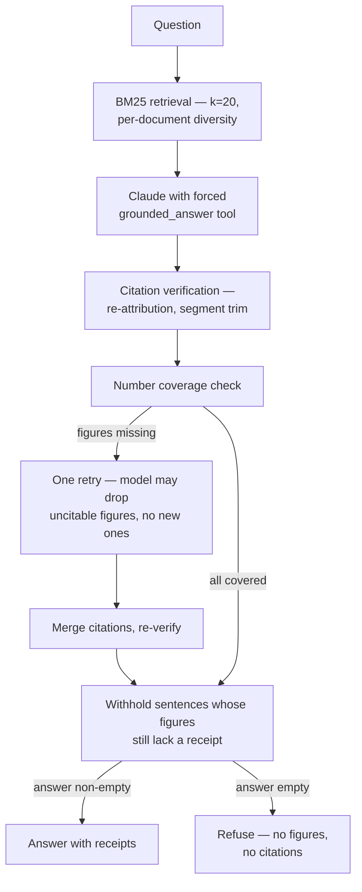

# Hawaiʻi BEAD Explorer

A weekend exploration of Hawaiʻi's public BEAD (Broadband Equity, Access, and
Deployment) documents. Answers are grounded only in the loaded sources; every
value shows its receipt.

Not affiliated with the State of Hawaiʻi, the University of Hawaiʻi, NTIA, the
FCC, or any vendor. Public data only.

## What it does

- Loads a small corpus of public government PDFs and HTML pages about
  Hawaiʻi's BEAD program.
- Serves a one-screen UI with a program-status panel, a "Where the gaps
  are" section (county map + two-series table), and a Q&A input.
- Answers only from the loaded corpus. Every answer includes verbatim quote
  receipts with links back to the source page.
- Refuses when the corpus does not contain the answer.

## Where the gaps are

The section between the status panel and the Ask box renders two views of
Hawaiʻi's unserved/underserved picture, each derived from a committed CSV
with a recorded source URL, sha256, and retrieval date:

- **FCC BDC — availability as of Dec 31, 2025.** State + county rows pulled
  by `pnpm fetch:fcc` from the Esri Living Atlas republication of the FCC
  Broadband Data Collection (see `data/fcc-hi-summary.meta.json`). The
  county map is a server-rendered inline SVG choropleth shaded by the
  unserved share (unserved ÷ total BSLs).
- **BEAD Final Proposal — Dec 31, 2024 fabric.** Approved-funded project
  areas pulled by `pnpm fetch:bead` from
  <https://www.hawaii.edu/broadband/wp-content/uploads/sites/40/2026/01/fp_locations_approved.xlsx>
  (7,009 rows). The script aggregates project_id suffix → county
  (HAWAII/HONOLULU/KAUAI/MAUI), classification 0=unserved · 1=underserved,
  technology 50=fiber · 61=LEO. Kalawao is not a separate BEAD project
  area; its BSLs fall under Maui project areas.
- **County geometry** is fetched by `pnpm fetch:geo` from Census TIGERweb
  (Generalized ACS2023). The Northwestern Hawaiian Islands rings of
  Honolulu County are dropped (all vertices west of longitude −160.6) so
  the map frames the main island chain.

The two series use different location fabrics and definitions (FCC
serviceable-location tiers vs. NTIA's approved BEAD-eligible list after
the challenge process); their counts are not additive across series.

## Architecture



Retrieval, verification, retry, withhold, and the receipts UI are laid out
step by step in the section below.

## How provenance is enforced

**Retrieval** is BM25 (via `minisearch`) over per-page chunks, with
stop-word removal in `processTerm`, and per-document diversity re-ranking
over a top-32 candidate pool controlled by
`CANDIDATE_POOL_MULTIPLIER = 4` and `PER_DOC_PENALTY = 0.7`
(the effective score is `raw / (1 + PER_DOC_PENALTY * count_from_same_doc)`).
The model receives k=12 passages, and the Anthropic Messages API is called
with a forced tool call (`grounded_answer`); the `temperature` parameter is
NOT sent because `claude-sonnet-5` rejects it as deprecated.

**Chunking is sentence-aware.** Each page is split into paragraphs (blank
lines where the source has them; otherwise a heuristic reflow joins
single-newline PDF lines into paragraphs and drops end-of-line hyphenation).
Paragraphs split on sentence boundaries, and sentences are greedy-packed
into ≤1,200 char chunks with `\n\n` preserved only at real paragraph
boundaries. Each chunk carries the previous chunk's last sentence (≤240
chars) as one-sentence overlap. Rationale in
`docs/findings-provenance.md` (chunker).

**Quote verification with re-attribution and segment-level trim.** Every
citation is verified server-side: its quote (after normalization) must be
a substring of the retrieved chunk it cites. If the quote is not in the
cited chunk but IS verbatim in one or more other retrieved chunks, the
citation is kept with the corrected `passage_id`, `reattributed: true`,
and picking the first hit in retrieval order. If the full quote is in no
retrieved chunk, the server splits it on sentence AND list-item
boundaries (newlines; `● • ○ ▪`; a segment-leading `-` or `–`) and
verifies each segment (≥15 normalized characters) against each retrieved
chunk, keeping the chunk with the most matching segments (ties: retrieval
order). If at least one segment matches, the citation survives with
`trimmed: true` and its `quote` replaced by the matched segments in
original order joined by `" … "`. Dropped citations are returned with a
reason (`too_short` or `not_found`) so the source of each drop is legible
without reading the code. If a non-refusal answer has zero surviving
citations, the server converts it to a refusal — the model's word is
never trusted.

**Number coverage with one retry.** After verification, every canonical
number, date, dollar amount, and percentage in the answer must appear as a
whole token (non-digit/non-decimal boundary on each side) in the
comma-stripped concatenation of the verified quotes. If not, the server sends
one follow-up turn in the same conversation telling the model that it may
remove any figure it cannot cite verbatim, but may not add new figures or
new claims. The follow-up hints which retrieved passages contain each
uncovered number. Citations from both turns are merged and re-verified.
The retry's answer is accepted only if (a) it is not refused, (b) the
figures it contains are a subset of the first turn's, and (c) every
remaining figure is covered by a verified quote — otherwise the first-turn
answer stands. `retried`, `answer_revised`, and `uncovered_numbers` are
surfaced in `GroundedResult` and in the UI.

**Withhold, don't refuse.** After the retry, any answer sentence whose
canonical numbers still lack a verified receipt is dropped from the answer
rather than refused whole. Sentence splitting is the chunker's rule
(`. ; ? !` + whitespace + a leading capital / opening quote / bracket, so
`No. 23` doesn't split); a sentence is withheld when any of its
`extractNumbers` matches the uncovered set. Only after every sentence with
uncovered figures is pruned does the server check the remaining answer: if
it is empty, the result is refused. The withheld figures themselves must
not appear in the API response or the UI — the UI shows only a one-line
notice `N figure(s) withheld: no verified receipt.` under the answer;
`pnpm ask --debug` is the only surface that prints the withheld sentences.
`GroundedResult.withheld_count` is public, `withheld_sentences` is
server-only and stripped before serialization.

**Refusals carry no figures and no citations.** Whenever the final result
has `refused: true` — whether the model refused directly or the server
converted the answer — the server empties `answer`, empties `citations`,
and rewrites `refusal_reason` to a generic figure-free sentence if the
model's own reason contains any digit. A figure-free model reason (e.g.
"the passages cover Hawaiʻi, not Texas") is kept as-is.

**Prompt caching.** The system prompt and the passages block carry
`cache_control: ephemeral`, so the first turn and the retry turn share a
cache prefix (they are byte-identical up through the passages), and repeat
runs of the same question hit the cache. `usage` is captured on every
response and returned in `GroundedResult`; `pnpm eval` prints per-fixture
`in=/cached=/out=` and a line-three cost summary using a single-source
price table.

Normalization (`src/lib/normalize.ts`) is used everywhere text is compared:
NFKD, drop combining marks, drop `ʻ ' ’ ‘ ` ´`, map en/em dashes to `-`, map
curly double quotes to `"`, lowercase, collapse whitespace.

## What this proves, and what it doesn't

**Proves:**

- Every figure the UI shows has a verbatim receipt at a page — the number
  appears as a whole token inside a verified quote, and the quote appears
  in the retrieved chunk it cites.
- Refusals carry no figures and no citations: whenever the final result is
  refused, `answer` and `citations` are emptied and any digit in the
  model's stated reason is replaced by a fixed generic sentence.
- The checks can fail: `pnpm eval --selftest` runs a fixture set where
  every case is deliberately broken and asserts each assertion goes red,
  so a `RESULT: pass` from the selftest means the assertions are wired
  to fire.

**Does not prove:**

- The answer is complete. Withheld sentences are counted, not shown; the
  model may also have omitted the fact the reader wanted.
- Prose claims without figures are true. Number coverage is numeric only:
  names, dates rendered as prose, and qualitative claims are not
  checked against the quotes.
- Retrieval found the best passage. BM25 returns k=20 passages weighted
  by per-document diversity; a better passage may exist outside that
  window, in which case the model may refuse or cite a weaker one.

For a three-minute click-through of the site and the checks, see
[`docs/walkthrough.md`](docs/walkthrough.md). For the durable engineering
lessons behind the pipeline (chunker, verification, retry rules,
retrieval, cost), see
[`docs/findings-provenance.md`](docs/findings-provenance.md).

## Data sources

Every document is committed under `data/raw/` for reproducibility. The
manifest is `data/sources.json`.

| id | Title | Publisher | Date |
|---|---|---|---|
| `fp` | State of Hawaiʻi BEAD Final Proposal v2.0 (NTIA-approved) | UH Broadband Office | 2025-11-18 |
| `fp-appendix` | BEAD Final Proposal Appendix v2.0 | UH Broadband Office | 2025-11-18 |
| `ntia-fp-overview` | BEAD Final Proposal: Hawaii Overview | NTIA BroadbandUSA | 2025-12 |
| `ipv1` | Initial Proposal Volume 1 (Approved-Final) | UH Broadband Office | 2024-06-04 |
| `ipv2` | Initial Proposal Volume 2 (Approved-Final) | UH Broadband Office | 2024-07-16 |
| `cpg` | Challenge Process Resource Guide v1.2 | UH Broadband Office | 2024-10-04 |
| `uhbo-challenge` | UHBO Challenge Process results page | UH Broadband Office | 2025-01-10 |
| `uhbo-final-proposal` | UHBO Final Proposal program page | UH Broadband Office | undated |
| `ntia-pr-2025-11-18` | NTIA release: approval of 18 Final Proposals | NTIA | 2025-11-18 |
| `ltgov-pr-2025-12-23` | Lt. Governor release: federal approval advances broadband expansion | State of Hawaiʻi | 2025-12-23 |
| `uh-news-2026-08-04` | UH News: $150M broadband expansion begins | UH News | 2026-08-04 |

FCC Broadband Data Collection Hawaiʻi state + county rows are pulled by
`scripts/fetch-fcc.ts` from the Esri Living Atlas republication of the FCC
BDC data (anonymous ArcGIS REST). See `data/fcc-hi-summary.meta.json` for the
retrieval date, query URLs, and vintage sentence.

## Run locally

```bash
pnpm install
# Put your Anthropic API key in .env.local
#   ANTHROPIC_API_KEY=sk-ant-...
#   ANTHROPIC_MODEL=claude-sonnet-5   # optional override
pnpm ingest        # extract corpus.json from data/raw/
pnpm fetch:fcc     # refresh data/fcc-hi-summary.csv
pnpm fetch:bead    # refresh data/bead-hi-project-areas.csv
pnpm fetch:geo     # refresh data/hi-counties.geojson
pnpm dev           # http://localhost:3000
pnpm eval          # live eval (needs API key)
pnpm eval --selftest  # offline assertion self-test
pnpm ask "<question>" [--retrieved] [--debug]   # run askGrounded locally; --debug shows withheld sentences
pnpm smoke <base-url>                 # POST two probe questions to a deployed route and verify the contract
```

## Deploy

Canonical URL: <https://bead.forpono.com> (alias: `bead-explorer.vercel.app`).

Deploys to Vercel via git connection: pushing to `main` deploys production;
pushing to any other branch produces a preview. The Vercel project is
`bead-explorer` under team `tclum-4994s-projects`. `npx vercel --prod` is
not needed. After a push, verify the deployed route with:

```bash
pnpm smoke https://bead.forpono.com
```

`pnpm smoke` first calls `GET /api/version` on the deployed base URL and
compares its `sha` to `git rev-parse HEAD` locally; on mismatch it
prints both, prints `RESULT: fail`, and exits 1 before running the
probes. Pass `--allow-sha-mismatch` to skip that check (e.g. against
`pnpm dev`); the run does not count as deploy verification.

## License

- Code: MIT.
- Documents in `data/raw/` remain the property of their respective publishers.
